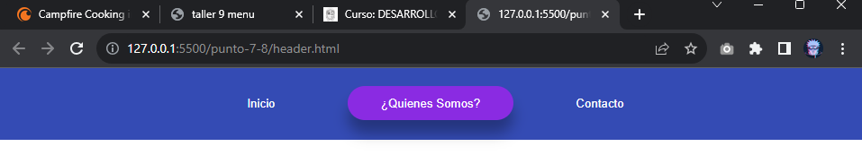

<h1>Taller 9 - Miguel Eduardo Moya Aguilera</h1>

<h2>Información</h2>

Curso: Full Stack Basico - Grupo 1

Profesor: Cristian Pantiño

<h2>Link de la Pagina Web</h2>
<a href="https://miguelmoya20.github.io/talle-9-full/">Link de la pagina web</a>

<h2>Punto 1: Link de Figma</h2>

<a href="https://www.figma.com/file/o5sUgoPwSvU6b82MvF8grk/Miguel-Moya?type=design&node-id=0%3A1&mode=design&t=mfyNDf7j22sfhNwZ-1">Link de Figma</a>

<h2>Punto 2: Diseño en HTML</h2>

<h2>Punto 3: Diseño con CSS</h2>

<h2>Punto 4: Títulos</h2>

<h2>Punto 5: Parrafo</h2>

<h2>Punto 6: link</h2>

<h2>Punto 7 y 8: Navegación</h2>

<h2>Punto 9: Tabla</h2>
